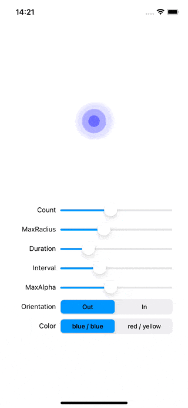

# WWPulseLayer

[](https://developer.apple.com/swift/) [](https://developer.apple.com/swift/)  [](https://developer.apple.com/swift/) [](https://developer.apple.com/swift/)

## [Introduction - 簡介](https://swiftpackageindex.com/William-Weng)
- [Use CAReplicatorLayer to achieve pulse animation effects.](https://github.com/Silence-GitHub/CoreAnimationDemo)
- [利用CAReplicatorLayer實現脈衝動畫功能。](https://www.cnblogs.com/silence-cnblogs/p/6951948.html)



## [Installation with Swift Package Manager](https://medium.com/彼得潘的-swift-ios-app-開發問題解答集/使用-spm-安裝第三方套件-xcode-11-新功能-2c4ffcf85b4b)
```bash
dependencies: [
    .package(url: "https://github.com/William-Weng/WWPulseLayer.git", .upToNextMajor(from: “1.0.0"))
]
```

## 可用函式
|函式|說明|
|-|-|
|start()|啟動動畫|
|stop()|結束動畫|

## Example
```swift
import UIKit
import WWPrint
import WWPulseLayer

final class ViewController: UIViewController {

    enum SliderType: Int {
        case Count = 101
        case MaxRadius = 102
        case Duration = 103
        case Interval = 104
        case MaxAlpha = 105
    }
    
    enum SegmentType: Int {
        case Orientation = 201
        case Color = 202
    }
    
    @IBOutlet weak var layerView: UIView!
    
    var pulseLayer: WWPulseLayer!

    override func viewDidLoad() {
        super.viewDidLoad()
    }
    
    override func viewDidAppear(_ animated: Bool) {
        super.viewDidAppear(animated)
        
        pulseLayer = WWPulseLayer()
        
        pulseLayer.frame = CGRect(origin: layerView.center, size: .zero)
        pulseLayer.start()
        
        layerView.layer.addSublayer(pulseLayer)
    }
    
    @IBAction func valueSliderAction(_ sender: UISlider) {
        
        guard let type = SliderType(rawValue: sender.tag) else { return }
        
        switch type {
        case .Count: pulseLayer.pulseCount = Int(sender.value)
        case .MaxRadius: pulseLayer.maxRadius = CGFloat(sender.value)
        case .Duration: pulseLayer.animationDuration = Double(sender.value)
        case .Interval: pulseLayer.animationInterval = Double(sender.value)
        case .MaxAlpha: pulseLayer.maxAlpha = CGFloat(sender.value)
        }
    }
    
    @IBAction func valueSegmentedAction(_ sender: UISegmentedControl) {
        
        guard let type = SegmentType(rawValue: sender.tag) else { return }
        
        switch type {
        case .Orientation: 
            pulseLayer.pulseOrientation = (sender.selectedSegmentIndex == 0) ? .out : .in
        case .Color:
            pulseLayer.inColor = (sender.selectedSegmentIndex == 0) ? .blue : .red
            pulseLayer.outColor = (sender.selectedSegmentIndex == 0) ? .blue : .yellow
        }
    }
}
```
